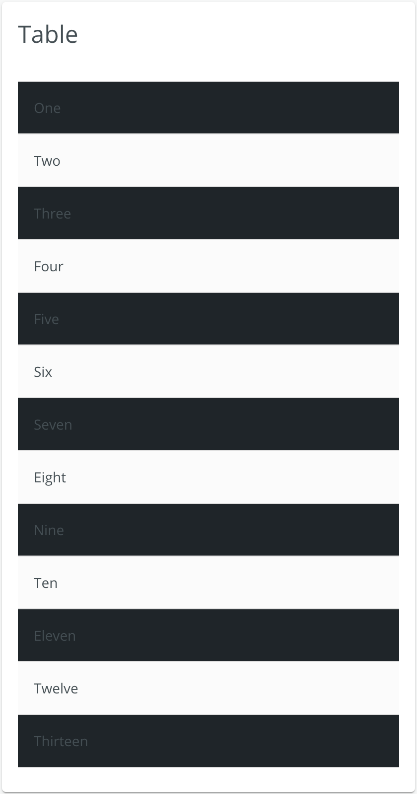

## Zebra Striping Table

Table styles can be overridden to have alternate colors for table rows.

<div style="width: 100%; text-align: center">
    
</div>

If you want to override a single table:

```ts
import Color from 'color';
import * as BLUIColors from '@brightlayer-ui/colors';
import { Table }  from '@material-ui';

...
const useStyles = () => makestyles ((theme: Theme) => {
    tableRow: {
        "&:nth-of-type(odd)": {
            backgroundColor: BLUIColors.darkBlack[300],
            "&:hover": {
                backgroundColor: Color(BLUIColors.darkBlack[300])
                    .mix(Color(BLUIColors.Black[200]), 0.5)
                    .string(),
            },
        }
    }
})

const classes = useStyles();
...

<Table>
    <TableRow  classes={{ root: classes.tableRow }}> 
        {/* Table row contents */}
    </TableRow>
</Table>
```

If you want to change the theme to do this for all tables, you can override the default theme to change this behavior:

```ts
import * as BluiTheme from '@brightlayer-ui/react-themes';
import * as BLUIColors from '@brightlayer-ui/colors';
import ThemeProvider from '@material-ui/styles/ThemeProvider';
import { createMuiTheme } from '@material-ui/core/styles';
import Color from 'color';
...

<ThemeProvider
        theme={createMuiTheme(
            Object.assign({}, BluiTheme.blue, {
                overrides: {
                    MuiTableRow: {
                        root: {
                            backgroundColor: BLUIColors.white[100],
                            '&:hover': {
                                backgroundColor: Color(BLUIColors.white[100])
                                    .mix(Color(BLUIColors.black[50]), 0.5)
                                    .string(),
                            },
                            '&:nth-of-type(odd)': {
                                backgroundColor: BLUIColors.black[900],
                                '&:hover': {
                                    backgroundColor: Color(BLUIColors.black[900])
                                        .mix(Color(BLUIColors.black[50]), 0.5)
                                        .string(),
                                },
                            },
                        },
                        hover: {},
                    },
                },
            })
        )}
    >
    {/* Your table contents */}
</ThemeProvider>

```
